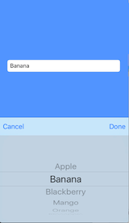

# MBTextFieldPicker
This is text field picker that helps you open picker inside **UITextField** without a single line line of code. It has basic features and advance ( **paste** option is disabled) as well. You will not able handle ***delegate*** of **UITextField** with **MBTextFieldPicker**.



##How to Use
It is very simple and easy to use. You no need to woory about any thing. You just need oto follow below mension steps. By default it supports String type data. You want someting else, you can [Customize Picker View](README.md##Customize).

> Create **IBOutlet** of **MBTextFieldPicker**

```swift
@IBOutlet weak var FriutTextField1: MBTextFieldPicker!
```

> Set your data **Array[String]**

```swift
friutTextField.dataSet = ["Apple", "Banana", "Blackberry", "Mango", "Orange", "Pineapple"]
friutTextField.autoUpdate = true //Automatically update textField value while selecting from PickerView
```

> Set actions only **if you want**

> * You can set both left and right button

> * Or you can set any one of then or **none** of them

> * Action Style

> > **close**: It will automatically close picker view on button action 
> > 
> > **default**: You need to manually [close](README.md####Closing) picker view


```swift
friutTextField.setRightButton("Done", style: .default) {
            print(self.friutTextField.selectedString)
            self.friutTextField.closePicker()
        }
        
        friutTextField.setLeftButton("Cancel", style: .close) {
            self.textField3.showDefaultString()
        }
```

> Accessing selected value, setting default selected value

>> If you want to manually set any value, first set as ```defaultSelectedString``` then call method ```showDefaultString()```


```swift
friutTextField.defaultSelectedString = "Banana"
let item = friutTextField.selectedString
friutTextField.showDefaultString()
```

####Closing Picker View

To close picker just call below method

```swift
friutTextField.closePicker()
```

##Customize Picker View
By default **MBTextFieldPicker** supports only string type of data, what if you want to show something else. No worry, you can customise Picker View itself. You jsut need to set ***pickerDelegate*** and implement **UIPickerViewDelegate** and **UIPickerViewDataSouce** protocol.

```swift
 friutTextField.pickerDelegate = self
```       

##Licence

**[MIT](https://github.com/swifty-iOS/MBTextFieldPicker/blob/master/LICENSE)**